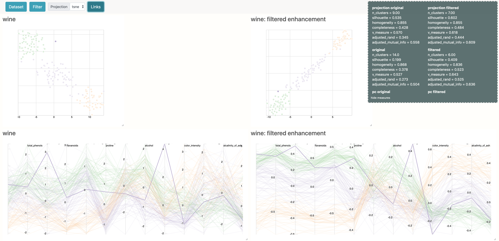

# Graph Signal Processing Data Filtering





## Run the server

```cd server```

* ```python run```

## Run the app

```cd front```

* ```npm install```
* ```npm start```

### Build the app

* ```npm run build```
